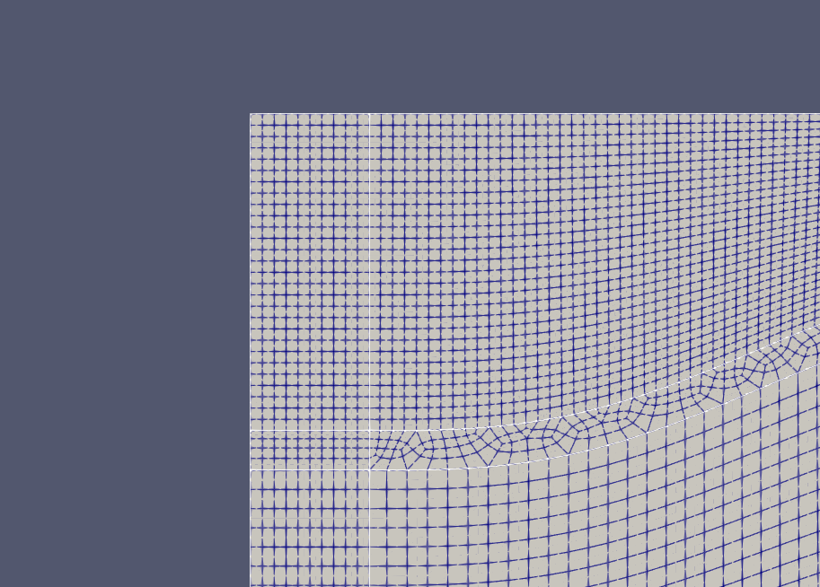

# Updated example to use Gmsh as the external mesher


This is an example for showing how to create external mesh files for the latest Gmsh and Specfem2D.

## Requirement
- Gmsh 4.0.0 or later (Python API is required)
- pygmsh
- meshio
- numba

With the following command, you can install the required packages.
```bash
pip install gmsh pygmsh meshio numba
```

## Usage
The ipython notebook `create_mesh_flat.ipynb` shows how to create a mesh file with pygmsh. The created mesh is converted h5+xdmf file with meshio. This file can be visualized with Paraview.
`create_mesh_topo.ipynb` shows how to create a mesh file with curved boundary.

`create_mesh_flat.ipynb` and `create_mesh_topo.ipynb` are the examples for creating the unstructured mesh (pml layer is created as structured mesh for stability of the simulation):

`create_mesh_flat_simple.ipynb` and `create_mesh_topo_simple.ipynb` are the examples for creating the structured mesh:


In both case, one single inner layer of each PML domain will be assigned as non-PML domain, which is also important to stabilize the simulation especially for a caluculation with attenuation.

After creating the mesh files in MESH directory, you can run the simulation with the following command.
```bash
./run_this_example.sh
```

## Note
A python class `Meshio2Specfem` is defined in `meshio2specfem.py`. This class is used to convert the meshio object to the format of Specfem2D.